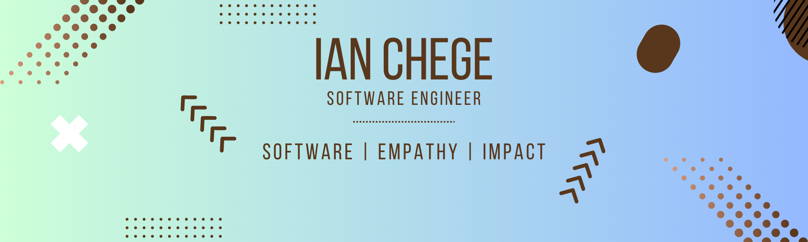

### Hi there 👋

I'm Ian, a Software Engineer at [TheosDev](https://theosdev.vercel.app/).

🚀 Building a collaborative [online code editor](https://codeeditorz.vercel.app/), focused on creating a platform that fosters real-time cooperation and seamless interaction among developers. Bridging geographical gaps and enabling developers worldwide to collaborate, learn, and grow together. 

✨ Check out also my latest article on [Building a successful CLI](https://theosdev.vercel.app/blog/Checklist-for-building-a-successful-cli).

<!-- 

Welcome to my GitHub profile! 👋

I'm Ian, a software engineer doing majorly Frontend Development. I focus on enhancing the user's experience and strive to make it impressive once I have a good understanding of what the user really goes through when they walk through the streets of an app.

## 📌 Pinned Repositories

 

 

 

 
 

## &#x1f4c8; GitHub Stats

 

 
 

## 🎯 Skills

 

 -->
